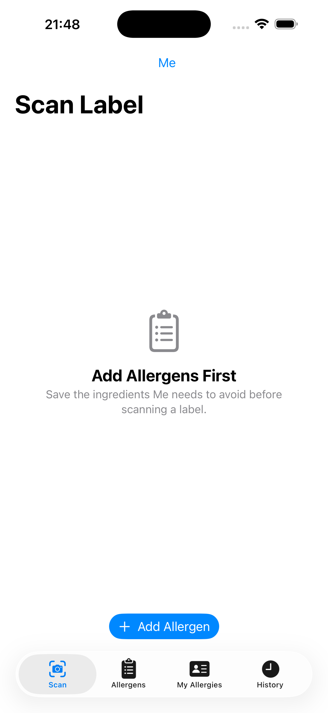
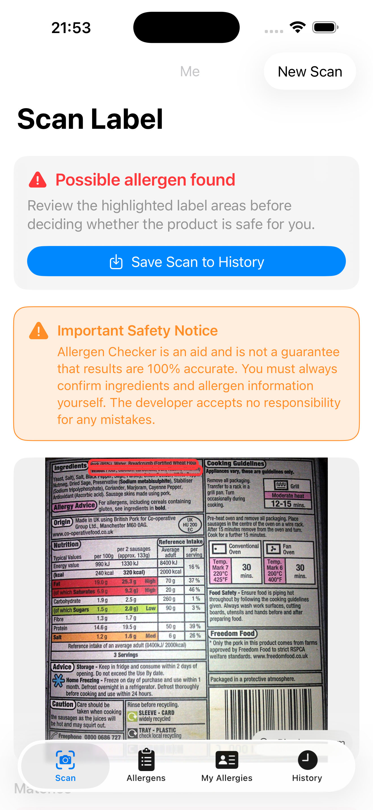
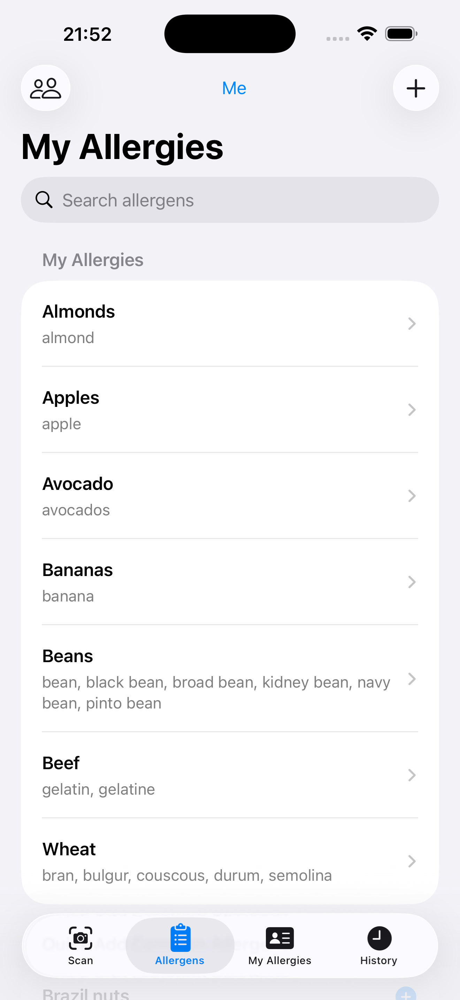
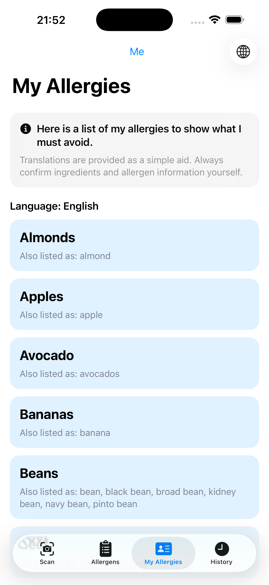
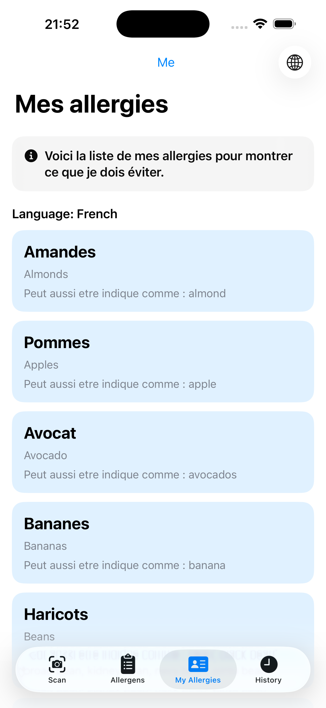
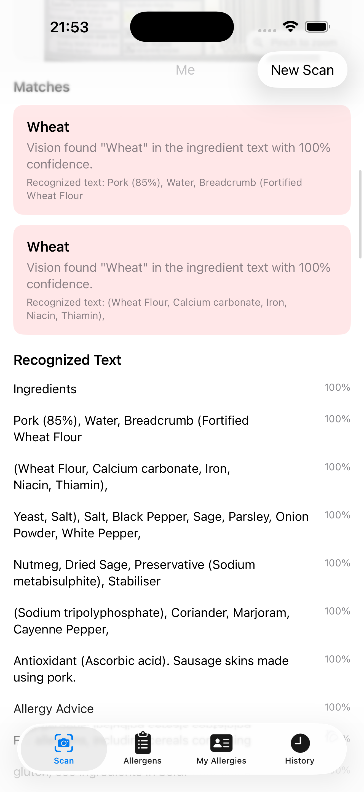

<section class="hero">
  
<strong>Allergen Checker for iPhone</strong>

  <h1>Check ingredient labels against the foods and additives you need to avoid.</h1>
  

    Allergen Checker helps you save a personal allergy profile, scan a product label with the camera or photo library, and review possible matches highlighted directly on the label image.
  

  

    <a class="button primary" href="#screenshots">View screenshots</a>
    <a class="button secondary" href="privacy-policy.html">Read privacy policy</a>
  

</section>

## Why It Is Useful

Reading ingredient labels can be slow, especially when names vary between products, countries, and brands. Allergen Checker gives you a focused second pass: it compares recognised label text with the allergens, related ingredients, and aliases you have saved for yourself or someone you shop for.

It is designed for everyday moments like checking a new snack, reviewing a product while travelling, keeping separate allergy lists for different people, or saving a scan so you can look again later.

  

    <h3>Faster label checks</h3>
    
Scan a clear photo of an ingredient label and let on-device text recognition find possible matches.

  

  

    <h3>Personal allergy profiles</h3>
    
Save allergens, aliases, related ingredients, and notes for different people.

  

  

    <h3>Useful for travel</h3>
    
Show a simple "My Allergies" list and translate supported allergen names into French, Spanish, German, Italian, Portuguese, Dutch, or Polish.

  

  

    <h3>Private by design</h3>
    
Allergen storage, label OCR, matching, and scan history currently happen on device.

  

## How The App Works

1. Add the allergens or ingredients you need to avoid.
2. Add aliases that should also trigger a warning, such as `whey` or `casein` for milk.
3. Take a photo of a product label or choose one from your photo library.
4. The app extracts label text on device using Apple Vision.
5. Recognised text is compared with your saved allergen names and aliases.
6. Possible matches are shown in a result summary and highlighted on the scanned image.
7. Save useful scans to history and rescan them later against the person's current allergy list.

## Screenshots

A quick tour of the app's main screens, using the App Store screenshots from `docs/AppStoreScreens/iPhone17ProMax/`.

  <figure>
    
    <figcaption><strong>Scan labels:</strong> choose a photo or use the camera to scan ingredients.</figcaption>
  </figure>
  <figure>
    
    <figcaption><strong>Review matches:</strong> possible allergens are called out and highlighted on the label.</figcaption>
  </figure>
  <figure>
    
    <figcaption><strong>Build your list:</strong> save allergens, aliases, notes, and related ingredients.</figcaption>
  </figure>
  <figure>
    
    <figcaption><strong>Show your allergies:</strong> keep a clear list ready for travel, restaurants, or shopping.</figcaption>
  </figure>
  <figure>
    
    <figcaption><strong>Translate for travel:</strong> show supported allergen names in another language when you need to explain what to avoid.</figcaption>
  </figure>
  <figure>
    
    <figcaption><strong>Save and review:</strong> keep useful scans in history so you can revisit the recognised text and matches later.</figcaption>
  </figure>

## Main Features

- Scan ingredient labels using the camera or photo library.
- Use on-device text recognition for ingredient labels.
- Highlight possible allergen matches on the scanned image.
- Save allergens, related ingredients, aliases, and notes.
- Quick add common UK and EU major allergens.
- Quick add E-number ingredients and additives.
- Create and manage allergy profiles for different people.
- Save scan results to history for later review.
- Rescan saved history using the person's current allergens.
- Translate allergy lists into supported languages for travel.

## Built For Real-World Checking

Allergen Checker is useful because it understands that allergy checking is personal. One person may need to avoid milk, while another also wants aliases like `whey`, `casein`, or a specific additive to trigger a warning. The app keeps those saved terms close at hand, then applies them consistently whenever you scan.

The history feature also helps when a label needs a closer look later. Saved scans include the image, recognised text, possible matches, and scan date, and they can be rescanned when someone's allergy list changes.

## Privacy And Safety

Allergen Checker does not require a developer-operated server. Saved allergy profiles, allergens, aliases, notes, scan images, recognised text, and history are stored locally on your device.

  <strong>Important safety notice:</strong> Allergen Checker is a helpful aid, not a medical device and not a guarantee that results are complete or accurate. Always check product packaging, ingredient information, and allergen advice carefully before deciding whether a product is safe for you.

For more detail, read the [privacy policy](privacy-policy.html).
